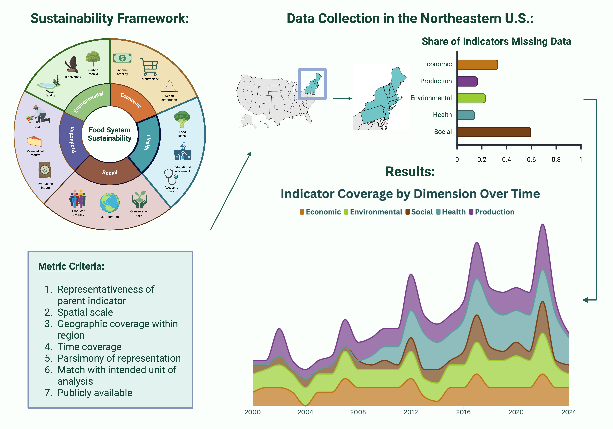

## About

  
  
Graphical Abstract

Assessing sustainability of regional food systems is only possible with data at the regional scale. "Inventory and Evaluation of Metrics for a Sustainability Indicator Framework in the Northeast US Food System" is a study of the availability and quality of regional data sources. It uses the framework developed by @wiltshire2024RegionalFoodSystema as a guide. 

A pre-print of the manuscript can be found here: [https://doi.org/10.31235/osf.io/gn32f_v1](https://doi.org/10.31235/osf.io/gn32f_v1). 

A companion site with reproducible analyses and results can be found [here](https://fsri.uvm.edu/sustainability-metrics/data-inventory/).

## Abstract

Food systems are both significant contributors to climate change being and increasingly threatened by it. Sustainability is critical in meeting nutritional needs within ecological bounds, and achieving it depends on access to targeted and actionable data. Sustainability indicator frameworks provide a scaffolding for data collection. While most assessments are conducted at the national or farm level, regional approaches are effective because cooperation among state and local government is feasible and stakeholders share common context.

We use a comprehensive indicator framework assessing the Northeast food system across five dimensions of sustainability to conduct a survey of publicly available data, including coverage, quality, and trends. We found key gaps in indicators of local economies, crop failure, farmer values, and food system governance. Some critical data were only available at the state level, like carbon emissions from agriculture. Further, monitoring of some metrics began only recently, precluding analysis over time. We identified 62 metrics fitting the framework, but only 30 were available at the county level with enough data to assess trends. Of these, half were improving, and one third were declining.

Access to accurate and targeted data is critical in improving regional food system sustainability. The gaps we identified should serve as a road map in developing monitoring programs. However, public datasets also contain biases, and misinterpretations are common. When used judiciously, the curation of datasets that are consistent, compatible, and easily accessed will be crucial in monitoring food systems and developing appropriate policies and interventions